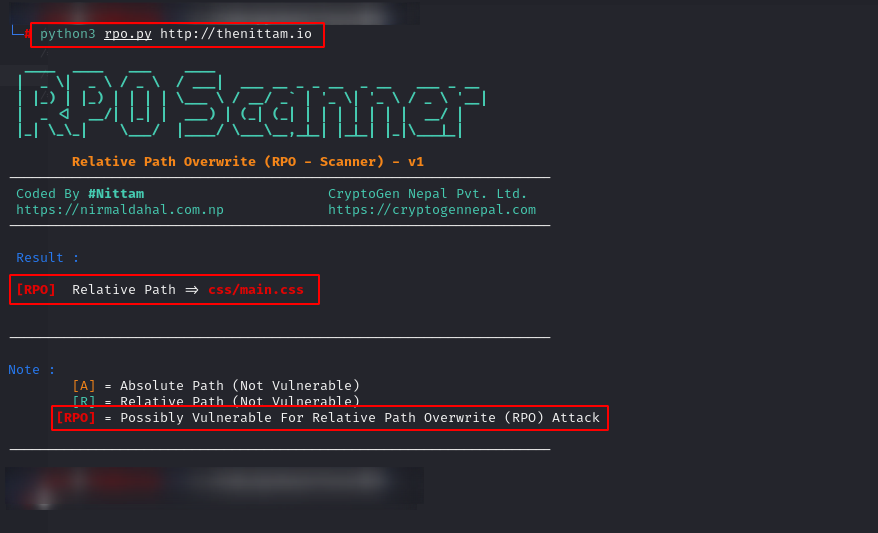

# RPOscanner By [@TheNittam](https://twitter.com/TheNittam)

Relative Path Overwrite Vulnerability Scanner - Version 1

Follow : [@CryptoGenNepal](https://twitter.com/cryptogennepal)

[](https://www.python.org/downloads/) [](https://github.com/TheNittam/RPOscanner/blob/master/LICENSE) [](https://github.com/TheNittam/RPOscanner/)



## Ever heard about **RPO Attack**?

If not here is the [video](https://www.youtube.com/watch?v=VrHkG5choM4) about **Relative Path Overwrite (RPO) Attack**. It's a lesser-known web-based vulnerability yet a very cool vulnerability. File descriptor was rewarded with 6000$ for his sweet exploit on this from Google. I have explained about this attack along with the mitigation techniques in our own language (**NEPALI** ).  It might be fruitful for not only security enthusiastic but also for developers.  

## Reference
Title | Researcher | Link 
------|------------|-----
RPO Gadget | [@filedescriptor](https://twitter.com/filedescriptor) | https://blog.innerht.ml/rpo-gadgets/
Detecting And Exploiting PRSSI | [James Kettle](https://twitter.com/albinowax) | https://portswigger.net/research/detecting-and-exploiting-path-relative-stylesheet-import-prssi-vulnerabilities

## How to use?
```python3 rpo.py <target_domain>```

## Required Module
```pip3 install requests```
